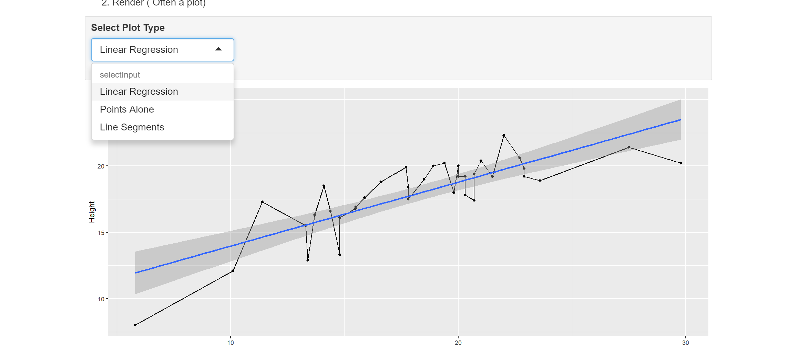
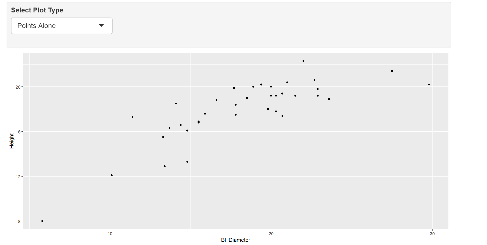
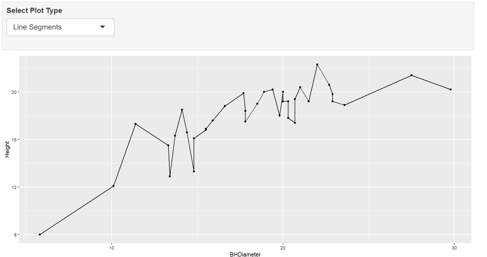

```{r setup, include=FALSE}
knitr::opts_chunk$set(echo = TRUE)
```

# Task 1

WD

```{r}
getwd()
```

# Task 2
**Reading in data set relating heights of spruce trees to breast height diameter. . .**

```{r}
spruce.df = read.csv("SPRUCE.csv")
head(spruce.df)
```

# Task 3
**Create a scatter plot to view the relationship between Tree Height and BHDiameter**

```{r}
plot(Height~BHDiameter, main = "Tree Height vs BHDiameter", xlab = "Breast Height Diameter (cm)", ylab = "Height of Spruce Tree (m)", pch = 21, bg = "blue", cex = 1.2, xlim = c(0, max(BHDiameter) *1.1), ylim = c(0, max(Height) * 1.1), data = spruce.df)
```

***Does there appear to be a straight line relationship?***
In the right half of the plot, there does seem to be a linear relationship. However, for smaller values of BHD, it appears the data set deviates significantly from a linear model. Modeling the entire data set would require some sort of curve.


```{r}
library(s20x)
lo = layout(matrix(1:3, nr=3, nc = 1, byrow = TRUE))
tsone = trendscatter(Height~BHDiameter, f=0.5, data = spruce.df)
tsone = trendscatter(Height~BHDiameter, f=0.6, data = spruce.df)
tsone = trendscatter(Height~BHDiameter, f=0.7, data = spruce.df)
```

**creating a linear model for spruce.df**

```{r}
spruce.lm = with(spruce.df, lm(Height~BHDiameter))
```

Make a new scatter plot and add the least squares regression line

```{r}
lo = layout(1)
with(spruce.df,
     plot(Height~BHDiameter, main = "Tree Height vs BH Diameter", xlab = "Breast Height Diameter (cm)", ylab = "Tree Height (m)", bg = "Blue", pch=21, cex=1.2, xlim = c(0, max(BHDiameter) *1.1), ylim = c(0, max(Height) * 1.1)
          )
     )

abline(spruce.lm)
```

**Comment on the graph, is a straight line appropriate? Consider the smoother curve also.**

Not quite. The straight line appears to act like a tangent line to the appropriate curve fitting the plot. This is backed up by the trendscatter plot which clearly shows curvature.


# Task 4

## Divide the graphical interface into 4 equal areas, use layout.show(4) and record the picture.
```{r}
lo = layout(matrix(1:4, nr=2, nc=2, byrow=TRUE))
layout.show(4)
mycex = 1.0
# Scatter plot and fitted line
with(spruce.df,
     plot(Height~BHDiameter, main = "Tree Height vs BH Diameter", xlab = "Breast Height Diameter (cm)", ylab = "Tree Height (m)", bg = "Blue", pch=21, cex=1.2, xlim = c(0, max(BHDiameter) *1.1), ylim = c(0, max(Height) * 1.1))
)
abline(spruce.lm)
# Residual line segments
# make yhat the estimates of E[Height | BHDiameter]
yhat = with(spruce.df, predict(spruce.lm, data.frame(BHDiameter)))
# OR you could use
yhat = fitted(spruce.lm)
with(spruce.df,
     plot(Height~BHDiameter, main = "RSS", xlab = "Breast Height Diameter (cm)", ylab = "Tree Height (m)", bg = "Blue", pch=21, cex=1.2, xlim = c(0, max(BHDiameter) *1.1), ylim = c(0, max(Height) * 1.1))
)
# Draw in segments making the residuals
with(spruce.df, 
     {
       segments(BHDiameter, Height, BHDiameter, yhat)
     })
abline(spruce.lm)
with(spruce.df, # MSS
     plot(Height~BHDiameter, main = "MSS", xlab = "Breast Height Diameter (cm)", ylab = "Tree Height (m)", bg = "Blue", pch=21, cex=1.2, xlim = c(0, max(BHDiameter) *1.1), ylim = c(0, max(Height) * 1.1))
)
with(spruce.df, abline(h = mean(Height)))
with(spruce.df, segments(BHDiameter, mean(Height), BHDiameter, yhat, col="Red"))
abline(spruce.lm)
with(spruce.df, #TSS
plot(Height~BHDiameter, bg="Blue", pch=21, main="TSS", xlab = "Breast Height Diameter (cm)", ylab = "Tree Height (m)", xlim=c(0,1.1*max(BHDiameter)), ylim=c(0,1.1*max(Height)))
)
with(spruce.df,abline(h=mean(Height)))
with(spruce.df, segments(BHDiameter,Height,BHDiameter,mean(Height),col="Green"))

       
```


## Calculate TSS, MSS, and RSS

```{r}
TSS=with(spruce.df,sum((Height-mean(Height))^2))
TSS

MSS=with(spruce.df,sum((yhat - mean(Height))^2))
MSS

RSS=with(spruce.df,sum((Height-yhat)^2))
RSS
```

MSS/TSS is R squared, and its relatively low value further supports the idea that the data should be fit using a curve.

## Does TSS = RSS + MSS

```{r}
RSS + MSS
```
equals
```{r}
TSS
```

# Task 5

## summarize

```{r}
summary(spruce.lm)
coef(spruce.lm)
```

## slope
0.4814743
## intercept
9.1468390
## equation of the fitted line
$$
\hat{Height} = \hat{\beta _0} + \hat{\beta _1}x
$$
$$
\hat{Height} = 9.1468 + (0.4815)x
$$
## make predictions

# Task 6

```{r}
library(ggplot2)
g = ggplot(spruce.df, aes(x=BHDiameter, y=Height, col=BHDiameter))
g = g + geom_point() + geom_line() + geom_smooth(method="lm")
g = g + ggtitle("Tree Height vs Breast Height Diameter")
g
```


# Task 7

This is how you place images in RMD documents

<center>
{ width=70% }

{ width=70% }

{ width=70% }
</center>


